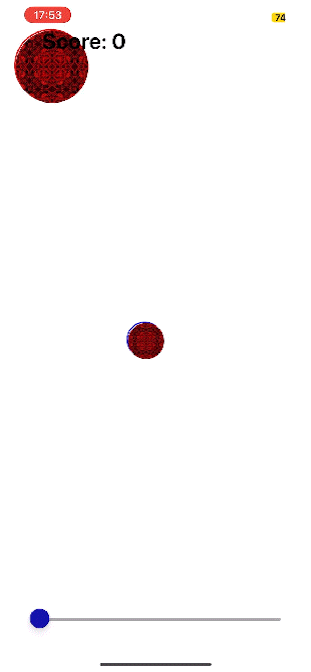
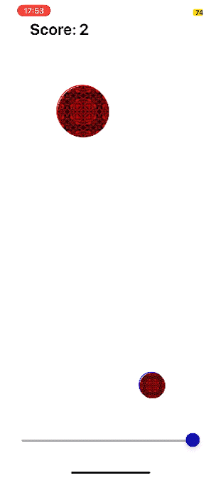
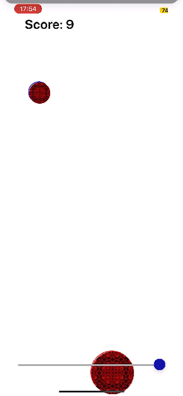

# Accelerometer-able Game

For this assignment, make sure your README includes User Stories and Screenshots and / or Wireframes that document your mobile application features. These should show prospective users how to use your application.

## User Stories

As a developer, I have never used React Native. This project was designed to interact with elements of React Native and Expo Go to create a mobile application with any purporse. I selected to try to create a game using the accelerometer of the game. 

## Concept

The application is fairly simple - tilt the phone to move the ball around the screen. The goal is to collect as many coins as possible without hitting moving circle. The game is over when the you hit the moving circle.

## Screenshots

Slider adjusts the speed of the circle moved by tilting the phone.\

Scoring will increase the speed of the moving circle that you have to avoid.\

Game over when you hit the moving circle.\

